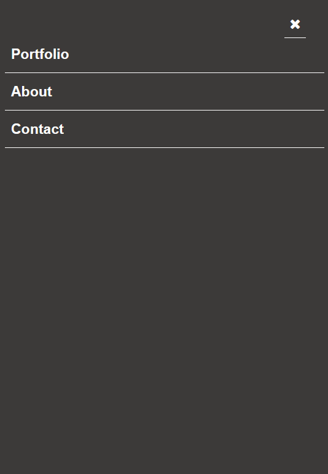

# Portfolio - Popup menu in mobile

  **This portfolio I built it using HTML, Css, and JavaScript**

  **Previous project changes:**
  1. Build Mobile Version First.
  2. Build Desktop Version.
  3. Add Accessibility to site.
  4. Add Mobile popup menu

  **New Changes:**
  1. Add Mobile popup Menu using JavaScript.

# Site Live Demo
  [Live Demo Link](https://telanet.github.io/Portfolio-popup-menu/)

# Site Screenshots Mockup

   
  

## Built With

- HTML.
- CSS.
- JavaScript.
- Linters.

## Authors

👤 **Benard Ngetich**
👤 **Linda**

- GitHub: [@telanet](https://github.com/telanet)
- Twitter: [@Ben54647605](https://twitter.com/Ben54647605)
